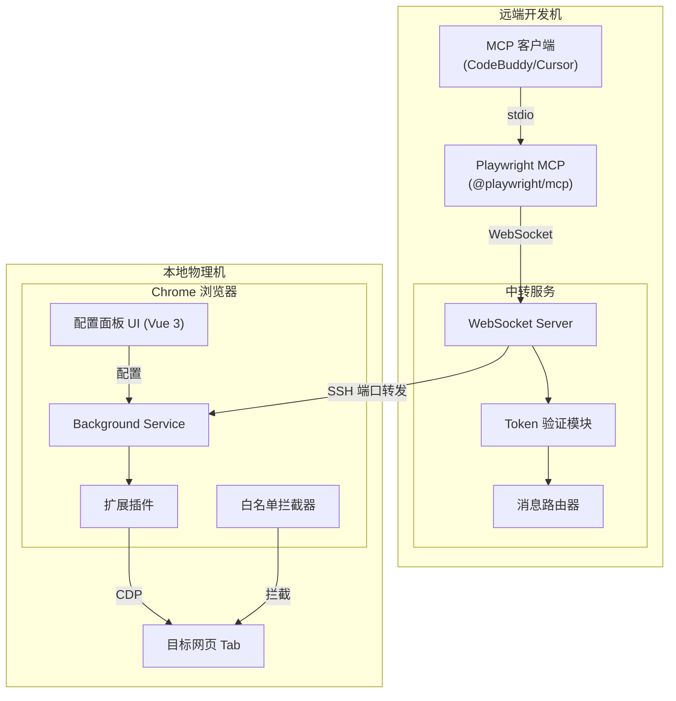
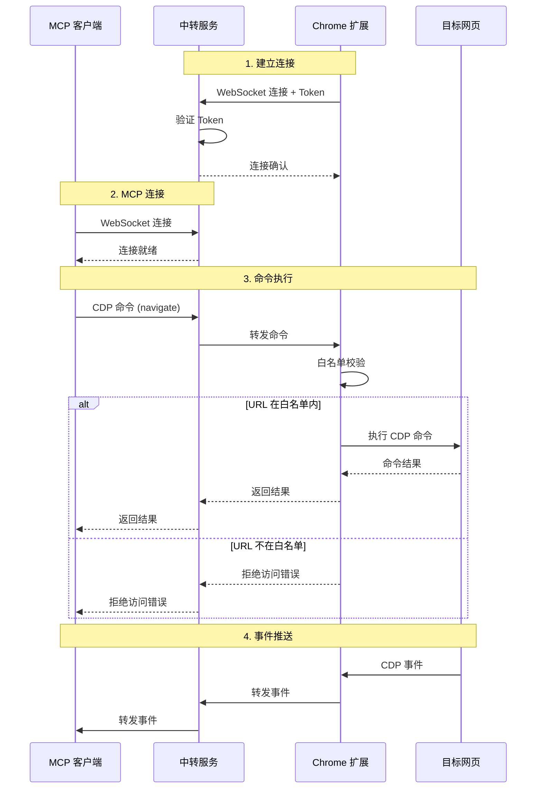

## 产品概述

基于微软官方开源的 Playwright MCP 进行二次开发，构建一个**中转服务 + Chrome 扩展插件**系统，打通远程开发机与本地调试机的 Playwright 通信限制。

## 核心功能

### 1. 中转服务 (Relay Server)

- 运行在可被远端和本地访问的位置（通过 SSH 端口转发）
- 接收来自远端 MCP 服务的 WebSocket 连接
- 转发请求到本地 Chrome 扩展

### 2. Chrome 扩展插件 (Extension)

- **Token 身份验证**: 与远端 MCP 服务之间进行身份校验，token 支持动态更改
- **双向通信**: 实现与远端 MCP 服务的实时双向通信
- **白名单管控**: 仅允许访问白名单内的网址，其他网址一律拦截
- **健康监控面板**: 查看远端 MCP 的连接状态、可用 tools 列表及简介
- **配置管理界面**: 可视化配置白名单、token 等参数
- **可发布**: 提供私钥文件支持插件发布到 Chrome Web Store

## 通信架构

```
┌─────────────────────────────────────────────────────────────┐
│  远端开发机                                                  │
│                                                             │
│  CodeBuddy/Cursor                                           │
│       ↓ (stdio/进程内通信)                                   │
│  Playwright MCP 服务 (@playwright/mcp) [原版，不改动]        │
│       ↓ (WebSocket ws://localhost:3000)                     │
│  中转服务 (Relay Server) [监听 :3000]                        │
└─────────────────────────────────────────────────────────────┘
                    ↓ SSH 端口转发 (VSCode: 3000 → 3000)
┌─────────────────────────────────────────────────────────────┐
│  本地物理机                                                  │
│                                                             │
│  Chrome 扩展 → ws://localhost:3000 (实际连到远端中转服务)    │
│       ↓ CDP (Chrome DevTools Protocol)                      │
│  目标网页                                                    │
└─────────────────────────────────────────────────────────────┘
```

**说明**：

- MCP 服务和中转服务都运行在**远端开发机**
- 使用 VSCode SSH 端口转发，本地 Chrome 扩展连接 `localhost:3000` 实际会转发到远端
- 原版 Playwright MCP 不需要改动，只需配置连接到中转服务即可

## 技术栈

| 组件 | 技术选型 |
| --- | --- |
| 中转服务 | Node.js + TypeScript + Express + ws |
| Chrome 扩展 | TypeScript + **Vue 3** + Vite + Manifest V3 |
| 参数校验 | Zod |
| 通信协议 | WebSocket + JSON-RPC |
| 构建工具 | pnpm + monorepo |


## 实现方案

### 整体架构

采用 **monorepo** 结构管理三个核心包：

1. `packages/relay-server` - 中转服务
2. `packages/extension` - Chrome 扩展插件
3. `packages/shared` - 共享类型定义和工具函数

### 核心技术决策

**1. WebSocket 双向通信**

- 中转服务同时作为 WebSocket Server（面向扩展）和 WebSocket Client Proxy（面向远端 MCP）
- 使用 JSON-RPC 2.0 协议规范消息格式，便于扩展和调试

**2. Token 身份验证机制**

- 扩展连接中转服务时携带 Token 进行握手验证
- Token 存储在 `chrome.storage.local`，支持用户随时更改
- 中转服务维护已验证连接的 Session 映射

**3. 白名单拦截实现**

- 使用 `chrome.webRequest.onBeforeRequest` API 拦截请求
- 在 CDP 命令执行前校验目标 URL
- 白名单规则支持通配符匹配（如 `*.example.com`）

**4. 健康检查与 Tools 发现**

- 定义 `getHealth` 和 `listTools` 协议方法
- 扩展定期发送心跳，中转服务响应健康状态和 tools 列表

## 实现注意事项

### 性能优化

- WebSocket 消息使用流式处理，避免大消息阻塞
- CDP 事件转发采用批量发送减少网络开销
- 白名单匹配使用预编译正则表达式缓存

### 可靠性保障

- 连接断开自动重连机制（指数退避）
- 消息队列缓存，防止连接闪断时消息丢失
- 完善的错误处理和日志记录

### 安全措施

- Token 不硬编码，由用户配置
- 所有外部输入经 Zod Schema 校验
- 白名单默认为空，需用户主动配置

## 架构设计

### 系统架构图



### 数据流设计



## 目录结构

```
playwright-mvp/
├── packages/
│   ├── relay-server/                    # [NEW] 中转服务
│   │   ├── src/
│   │   │   ├── index.ts                 # 服务入口，初始化 Express 和 WebSocket Server
│   │   │   ├── config.ts                # 配置加载，从环境变量读取端口、密钥等
│   │   │   ├── route/
│   │   │   │   └── index.ts             # HTTP 路由定义，健康检查端点
│   │   │   ├── controller/
│   │   │   │   ├── ws/
│   │   │   │   │   ├── index.ts         # WebSocket 连接控制器
│   │   │   │   │   └── validator.ts     # Zod 消息校验器
│   │   │   │   └── health/
│   │   │   │       └── index.ts         # 健康检查控制器
│   │   │   └── services/
│   │   │       ├── auth-service.ts      # Token 验证服务
│   │   │       ├── relay-service.ts     # 消息转发服务，管理 MCP 和扩展的连接映射
│   │   │       ├── session-service.ts   # 会话管理服务
│   │   │       └── index.ts             # 服务统一导出
│   │   ├── package.json
│   │   └── tsconfig.json
│   │
│   ├── extension/                       # [NEW] Chrome 扩展插件（基于原版改造）
│   │   ├── src/
│   │   │   ├── background/
│   │   │   │   ├── index.ts             # Service Worker 入口
│   │   │   │   ├── relay-connection.ts  # 中转服务连接管理，Token 握手
│   │   │   │   ├── cdp-handler.ts       # CDP 命令处理和事件转发
│   │   │   │   └── whitelist.ts         # 白名单拦截逻辑
│   │   │   ├── ui/
│   │   │   │   ├── popup/
│   │   │   │   │   ├── App.vue          # 弹窗主界面，显示连接状态
│   │   │   │   │   ├── main.ts          # 弹窗入口
│   │   │   │   │   └── index.html       # 弹窗 HTML
│   │   │   │   └── options/
│   │   │   │       ├── App.vue          # 配置页面主组件
│   │   │   │       ├── components/
│   │   │   │       │   ├── TokenConfig.vue      # Token 配置组件
│   │   │   │       │   ├── WhitelistConfig.vue  # 白名单配置组件
│   │   │   │       │   ├── ServerConfig.vue     # 服务器地址配置
│   │   │   │       │   └── HealthPanel.vue      # 健康状态和 Tools 列表面板
│   │   │   │       ├── main.ts          # 配置页入口
│   │   │   │       └── index.html       # 配置页 HTML
│   │   │   ├── storage/
│   │   │   │   └── config-storage.ts    # chrome.storage 封装，配置读写
│   │   │   └── types/
│   │   │       └── index.ts             # 扩展内部类型定义
│   │   ├── icons/                       # 扩展图标资源
│   │   ├── manifest.json                # Manifest V3 配置
│   │   ├── vite.config.ts               # Vite 构建配置（Vue 插件）
│   │   ├── package.json
│   │   └── tsconfig.json
│   │
│   └── shared/                          # [NEW] 共享模块
│       ├── src/
│       │   ├── protocols/
│       │   │   ├── messages.ts          # JSON-RPC 消息类型定义
│       │   │   └── schemas.ts           # Zod 消息校验 Schema
│       │   ├── types/
│       │   │   └── index.ts             # 共享类型（Tool, HealthStatus 等）
│       │   └── utils/
│       │       ├── whitelist-matcher.ts # 白名单 URL 匹配工具
│       │       └── logger.ts            # 统一日志工具
│       ├── package.json
│       └── tsconfig.json
│
├── keys/                                # [NEW] 发布密钥目录
│   └── .gitkeep                         # 占位文件，实际密钥不入库
│
├── docs/
│   └── target.md                        # 已有需求文档
├── CLAUDE.md                            # 已有项目说明
├── package.json                         # [NEW] 根 package.json (pnpm workspace)
├── pnpm-workspace.yaml                  # [NEW] pnpm workspace 配置
├── tsconfig.base.json                   # [NEW] 基础 TypeScript 配置
├── .env.example                         # [NEW] 环境变量示例
└── README.md                            # [MODIFY] 更新项目说明
```

## 关键代码结构

### 1. 通信协议消息类型 (packages/shared/src/protocols/messages.ts)

```typescript
// JSON-RPC 2.0 基础类型
interface JsonRpcRequest {
  jsonrpc: '2.0';
  id: number | string;
  method: string;
  params?: unknown;
}

interface JsonRpcResponse {
  jsonrpc: '2.0';
  id: number | string;
  result?: unknown;
  error?: { code: number; message: string; data?: unknown };
}

// 业务消息类型
type RelayMessage =
  | { method: 'auth'; params: { token: string } }
  | { method: 'forwardCDPCommand'; params: { sessionId?: string; method: string; params?: unknown } }
  | { method: 'forwardCDPEvent'; params: { sessionId?: string; method: string; params?: unknown } }
  | { method: 'getHealth' }
  | { method: 'listTools' }
  | { method: 'attachToTab'; params: { tabId: number } };
```

### 2. 扩展配置类型 (packages/extension/src/types/index.ts)

```typescript
interface ExtensionConfig {
  relayServerUrl: string;      // 中转服务地址
  token: string;               // 身份验证 Token
  whitelist: string[];         // URL 白名单列表
  autoReconnect: boolean;      // 是否自动重连
  reconnectInterval: number;   // 重连间隔(ms)
}

interface ConnectionStatus {
  connected: boolean;
  serverUrl: string;
  lastConnectedAt?: number;
  error?: string;
}

interface HealthStatus {
  status: 'healthy' | 'unhealthy' | 'unknown';
  latency: number;
  tools: ToolInfo[];
}

interface ToolInfo {
  name: string;
  description: string;
}
```

## 设计风格

Chrome 扩展采用现代简洁的设计风格，以实用性为核心。整体视觉遵循 Chrome 扩展设计规范，使用清爽的浅色背景配合蓝色主题色，营造专业可靠的技术工具感。

## 页面规划

### 1. Popup 弹窗页面 (宽度 360px)

**顶部状态栏**

- 左侧显示扩展 Logo 和名称 "Playwright MVP"
- 右侧显示连接状态指示灯（绿色连接/红色断开/黄色连接中）

**连接信息区**

- 显示当前连接的中转服务地址
- 显示已连接的 Tab 信息（标题、URL 缩略）
- 连接/断开按钮

**快捷操作区**

- "打开配置" 按钮跳转到 Options 页面
- "查看 Tools" 按钮展开 tools 列表

**底部状态区**

- 显示最后连接时间
- 显示网络延迟

### 2. Options 配置页面

**左侧导航**

- 服务器配置
- Token 设置
- 白名单管理
- 健康监控

**服务器配置区块**

- 中转服务 URL 输入框
- 自动重连开关
- 重连间隔设置滑块

**Token 配置区块**

- Token 输入框（密码样式，可切换显示）
- 重新生成 Token 按钮
- Token 复制按钮

**白名单配置区块**

- 白名单列表（卡片式展示）
- 添加新规则输入框（支持通配符提示）
- 批量导入/导出按钮
- 每条规则支持编辑/删除操作

**健康监控区块**

- 服务器连接状态卡片
- 延迟监控图表（简易折线图）
- Tools 列表展示（表格形式：名称、描述、状态）

## 子代理

### SubAgent

- **code-explorer**
- 用途: 深入探索 playwright-mcp 原始代码实现细节，理解 CDP 命令转发机制和扩展架构
- 预期结果: 获取完整的代码实现参考，确保新扩展与原版兼容